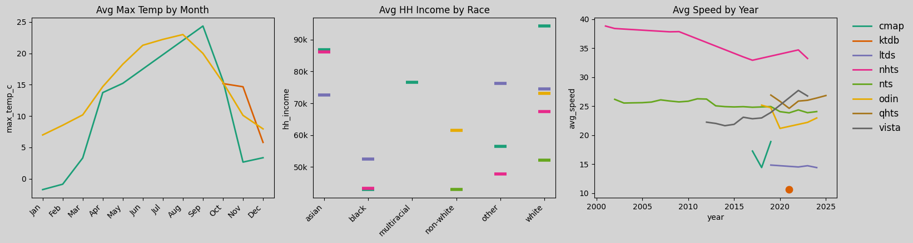

[](https://github.com/fredshone/foundata/actions/workflows/weekly.yml)

Foundata is a pipeline for creating reconciled household travel surveys, aimed at enabling *foundational* or *world* models of human behaviour — and a useful source of code for those wishing to work with available datasets. We also have a pre-processed dataset of one-million openly available persons and their plans [here](https://github.com/fredshone/foundata/tree/main/data/).

The project is intended to be uses as a discoverable cli: `uv run foundata --help`.

### Progress

The latest output using 'foundata run' (home based with no consecutive home, work or education acts) is as follows:

| source | plans | missing data | trips | kms (millions) |
|------|-----|------------|-----|--------------|
| ktdb | 120,100 | 37% | 285,011 | 0.8 |
| ltds | 60,124 | 34% | 106,668 | 0.9 |
| nts | 2,481,048 | 22% | 4,413,614 | 45.3 |
| odin | 270,193 | 26% | 634,515 | 7.1 |
| vista | 89,466 | 29% | 233,600 | 2.0 |
| cmap | 25,385 | 5% | 74,572 | 0.5 |
| qhts | 48,794 | 33% | 117,998 | 1.2 |
| nhts | 631,065 | 25% | 2,201,666 | 24.9 |
| **total** | **3,726,175** | **23%** | **8,067,644** | **82.6** |


### Person Attributes Status

Categorical person attributes, **Blank** signifies missing or "unknown" data:


There has been a lot of effort to consolidate categories across the different data sources. You can see the mappings used in `/configs`. Note that (i) we allow unknown categories (nulls), and (ii) in some cases we allow "overlapping" categories, such as `employed` and `ft-employed`.

Numeric person attributes:


A sample of some trends:



### Trips (As 24hr Plans) Status

We encode human activity plans as sequences of trips, joinable by a unique person id (pid) to each other and their attributes. Temporal and spatial consistency is enforced, so that activity sequences should be physically plausible.

We currently map all activities to the following types: {home, work, education, visit, medical, leisure, shop, escort, other}.

We currently map all transport modes to the following types: {car, walk, bike, bus, rail, other}.


### ToDo

- Provide additional output formats; combined acts and trips, acts with/out trips, forward/backward activity/trip combining, matsim xml?
- Collect additional features, such as weather conditions and accessibility.
- We currently combine all plan attributes as *person* attributes, but in fact we use *household*, *person*, *day*, and *plan* attributes. We could distinguish these better.
- More data, see below: 


|  source           |     | persons  | years     | label availability | source  |
| ----------------- |---- | -------- |-----------|---------------|--------------------|
| ODIN              | netherlands | 200k | 21        | C             | [request](https://ssh.datastations.nl/dataset.xhtml?persistentId=doi:10.17026/SS/TR1TUW)     |
| KTDB              | S.Korea | 100k | 21        | C             | [request](https://www.ktdb.go.kr/www/index.do) (stay on korean language site)     |
| NTS               | UK  | 1.7m     | 02-23     | A             | [request](https://ukdataservice.ac.uk/) (not open)            |
| CMAP              | US  | 30k      | 17-19     | A-            | [data](https://github.com/CMAP-REPOS/mydailytravel) (open) |
| NHTS              | US  | 700k       | 01,09,17,22 | A           | [data](https://nhts.ornl.gov/downloads) & [docs](https://nhts.ornl.gov/documentation) (open) |
| QHTS        | AUS | 50k     | 12-24     | A-            | [data](https://www.data.qld.gov.au/dataset/queensland-household-travel-survey-series) (open) |
| VISTA         | AUS | 100k     | 12 -> 25  | B+            | [here](https://opendata.transport.vic.gov.au/dataset/victorian-integrated-survey-of-travel-and-activity-vista) (open) |
| LTDS              | UK  | 70k     | 19 -> 24  | B+            | request from TfL (open) |
| **Metropolitan (US datasets)** :   ||||                        | [data](https://www.nrel.gov/transportation/secure-transportation-data/tsdc-metropolitan-travel-survey-archive) (open) |
| California        | US  | 40k      | 01        | OK?           |
| LA                | US  | ?        | 01        | BAD?          |
| Seattle           | US  | 37k      | 00/02     | OK?           |
| SanFran           | US  | 35k      | 00        | OK?           |
| NY                | US  | 27k      | 98        | OK?           |
| Philly            | US  | 10k      | 00        | OK?           |
| Pheonix           | US  | 10k      | 02        | OK?           |
| Baltimore         | US  | 8k       | 01        | OK?           |
| Indiana           | US  | 8k       | 07/08     | OK?           |
| Spokane           | US  | 7k       | 05        | BAD?          |
| Idaho             | US  | 6k       | 02        | OK?           |
| Columbia          | US  | ~3k      | 07        | OK?           |
| Anchorage         | US  | 3k       | 01        | OK?           |


## Usage

### Setup

```bash
uv sync          # install dependencies and register the CLI entry point
foundata --help
```

### Adding a new source

1. **Scaffold boilerplate** — generates empty YAML configs and a stub loader:
   ```bash
   python scripts/scaffold_source.py <source>
   ```

2. **Populate YAML configs** in `configs/<source>/`:
   - `hh_dictionary.yaml` — household column mappings and value remappings
   - `person_dictionary.yaml` — person column mappings and value remappings
   - `trip_dictionary.yaml` — trip column mappings and value remappings

3. **Validate YAML configs** against the template schema:
   ```bash
   foundata validate-config <source>
   ```
   Fix any reported ERRORs (value labels not in the template set). WARNs for
   intermediate fields are expected and can be ignored.

4. **Implement `load()`** in `foundata/<source>.py` following the pattern of
   existing loaders (e.g. `nhts.py`). The function should return
   `(attributes_df, trips_df)` normalised to the template schema.

5. **Run the loader, write CSVs, then validate output**:
   ```bash
   foundata validate-table attributes.csv trips.csv
   ```

6. **Add the source to `foundata/run.py`** so it is included in the full pipeline run (follow the existing `if "source" in sources:` pattern).

### Running specific sources

Use `--select` / `-s` to run only a subset of sources, or `--omit` / `-x` to exclude sources:

```bash
# Run KTDB only
foundata run --data-root ~/Data/foundata --select ktdb --output /tmp/out

# Run KTDB and NTS
foundata run --data-root ~/Data/foundata -s ktdb -s nts --output /tmp/out

# Run everything except NTS
foundata run --data-root ~/Data/foundata --omit nts --output /tmp/out
```

Available sources: `ltds`, `vista`, `qhts`, `cmap`, `nhts`, `nts`, `ktdb`.

### Binning numeric attributes

The `bin` command discretises numeric columns in an attributes CSV into labelled string bins, using the same quantile/uniform logic as the pipeline's `binned_attributes.csv` output — but runnable on any attributes file with full control over bin counts.

```bash
# All numeric columns binned into 5 quantile bins (default)
foundata bin attributes.csv

# Override the default bin count
foundata bin attributes.csv --default 8

# Per-column overrides: --COLUMN N takes precedence over --default
foundata bin attributes.csv --default 5 --age 10 --hh_income 3

# Uniform (equal-width) bins, explicit output path
foundata bin attributes.csv --default 5 --method uniform --output binned.csv
```

Options:

| Option | Short | Default | Description |
|--------|-------|---------|-------------|
| `--default N` | `-n` | `5` | Default number of bins for all numeric columns. |
| `--method` | `-m` | `quantile` | `quantile` (equal-frequency) or `uniform` (equal-width). |
| `--output PATH` | `-o` | `<input>_binned.csv` | Output CSV path. |
| `--COLUMN N` | | | Per-column bin count override (e.g. `--age 10`). |

### Filtering output CSVs

The `filter` command group applies post-processing filters to `attributes.csv` / `trips.csv` outputs.
All filter commands accept `-a`/`--attributes` (optional), `-t`/`--trips` (required), and output options `-o` (directory), `-oa` (explicit attributes path), `-ot` (explicit trips path).

```bash
foundata filter --help
```

| Command | Description |
|---------|-------------|
| `homebased` | Keep only plans whose first and last activity is home. |
| `missing-acts-or-modes` | Remove plans with null or `unknown` activities or modes. |
| `consecutive-activities` | Remove plans with consecutive same-type activities (e.g. work→work). Configurable via `-n`/`--non-consecutive-types` (default: `home`, `work`, `education`). |
| `negative-trips` | Remove plans containing trips where `tst > tet`. |
| `negative-activities` | Remove plans with overlapping trip times (negative activity durations). |
| `null-times` | Remove plans with null trip start or end times. |
| `time-consistent` | Apply all time-consistency filters in one step. |
| `attributes` | Filter persons on a column value and restrict trips to survivors. |

Example:

```bash
foundata filter consecutive-activities -t trips.csv -a attributes.csv -n work -n education -o output/
```

### Splitting into train/test sets

The `split` command creates train/test splits of one or more CSVs, keeping all records for each person entirely in one set (never split across both). Pass any number of CSV files — they must all share the same set of group IDs.

```bash
foundata split attributes.csv trips.csv activities.csv --split 20 --output /tmp/split/
```

Output:

```
Split on 'pid': 800 train / 200 test (20%)
  attributes.csv                 →     800 train /     200 test rows
  trips.csv                      →    6431 train /    1612 test rows
  activities.csv                 →    9204 train /    2301 test rows
Wrote outputs to /tmp/split/
```

Each input file produces `<stem>_train.csv` and `<stem>_test.csv` in the output directory.

Options:

| Option | Short | Default | Description |
|--------|-------|---------|-------------|
| `--group COL` | `-g` | `pid` | Column to group by. |
| `--split PCT` | `-s` | `20` | Test set size as a percentage. |
| `--output DIR` | `-o` | parent of first input | Output directory. |
| `--seed N` | | `42` | Random seed for reproducibility. |
