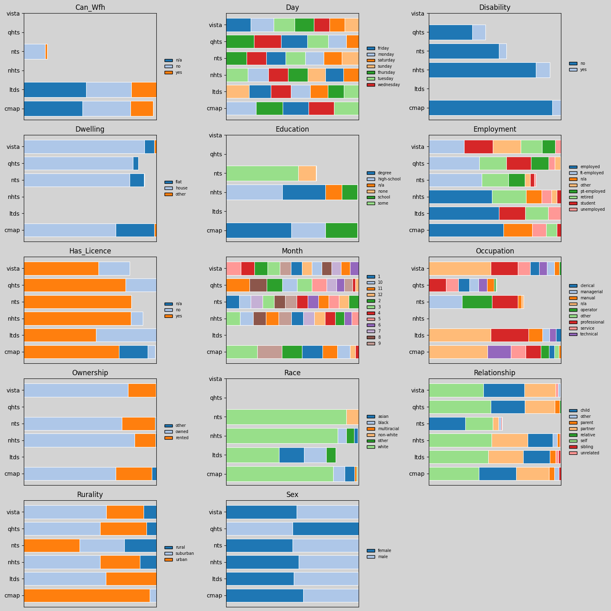

Hello, we are combining as many travel survey data sources as possible and combining them in a somewhat consistent manner.

### Progress

| source | persons | missing data     | trips   | kms (millions) |
|--------|---------|-----------|---------|-----------------|
| London UK (LTDS)   | 71,734  | 27%      | 137,900 | 1.4        |
| UK (NTS)    | 1,728,067 | 14%    | 5,106,905 | 65.2   |
| US (NHTS)   | 716,376 | 16%      | 2,604,832 | 42.1     |
| Chicago US (CMAP)   | 31,540  | ~0%       | 101,965 | 0.8        |
| Victoria AUS (VISTA)  | 94,821  | 20%      | 257,557 | 2.5        |
| Queensland AUS (QHTS)   | 51,481  | 25%      | 126,485 | 1.4        |
| **total** | **2,694,019** | **15%** | **8,461,994** | **115.3** |

### Person Attributes Status

Categorical person attributes, **Blank** signifies missing or "unknown" data:

Numeric person attributes:

### Trips (As 24hr Plans) Status

Good.

### ToDo

|  source           |     | persons  | years     | label quality | data availability  |
| ----------------- |---- | -------- |-----------|---------------|--------------------|
| NTS               | UK  | 400k     | 02-23     | A             | [request](https://ukdataservice.ac.uk/)             |
| CMAP              | US  | 30k      | 17-19     | A-            | [data](https://github.com/CMAP-REPOS/mydailytravel) |
| NHTS              | US  | 1m       | 01,09,17,22 | A           | [data](https://nhts.ornl.gov/downloads) & [docs](https://nhts.ornl.gov/documentation) |
| Queensland        | AUS | 100k     | 12-24     | A-            | [data](https://www.data.qld.gov.au/dataset/queensland-household-travel-survey-series) |
| Melbourne         | AUS | 100k     | 12 -> 25  | B+            | [here](https://opendata.transport.vic.gov.au/dataset/victorian-integrated-survey-of-travel-and-activity-vista) |
| LTDS              | UK  | 100k     | 19 -> 24  | B+            | request from TfL |
| **Metropolitan (US datasets)** :   ||||                        | [data](https://www.nrel.gov/transportation/secure-transportation-data/tsdc-metropolitan-travel-survey-archive) |
| California        | US  | 40k      | 01        | OK?           |
| LA                | US  | ?        | 01        | BAD?          |
| Seattle           | US  | 37k      | 00/02     | OK?           |
| SanFran           | US  | 35k      | 00        | OK?           |
| NY                | US  | 27k      | 98        | OK?           |
| Philly            | US  | 10k      | 00        | OK?           |
| Pheonix           | US  | 10k      | 02        | OK?           |
| Baltimore         | US  | 8k       | 01        | OK?           |
| Indiana           | US  | 8k       | 07/08     | OK?           |
| Spokane           | US  | 7k       | 05        | BAD?          |
| Idaho             | US  | 6k       | 02        | OK?           |
| Columbia          | US  | ~3k      | 07        | OK?           |
| Anchorage         | US  | 3k       | 01        | OK?           |

