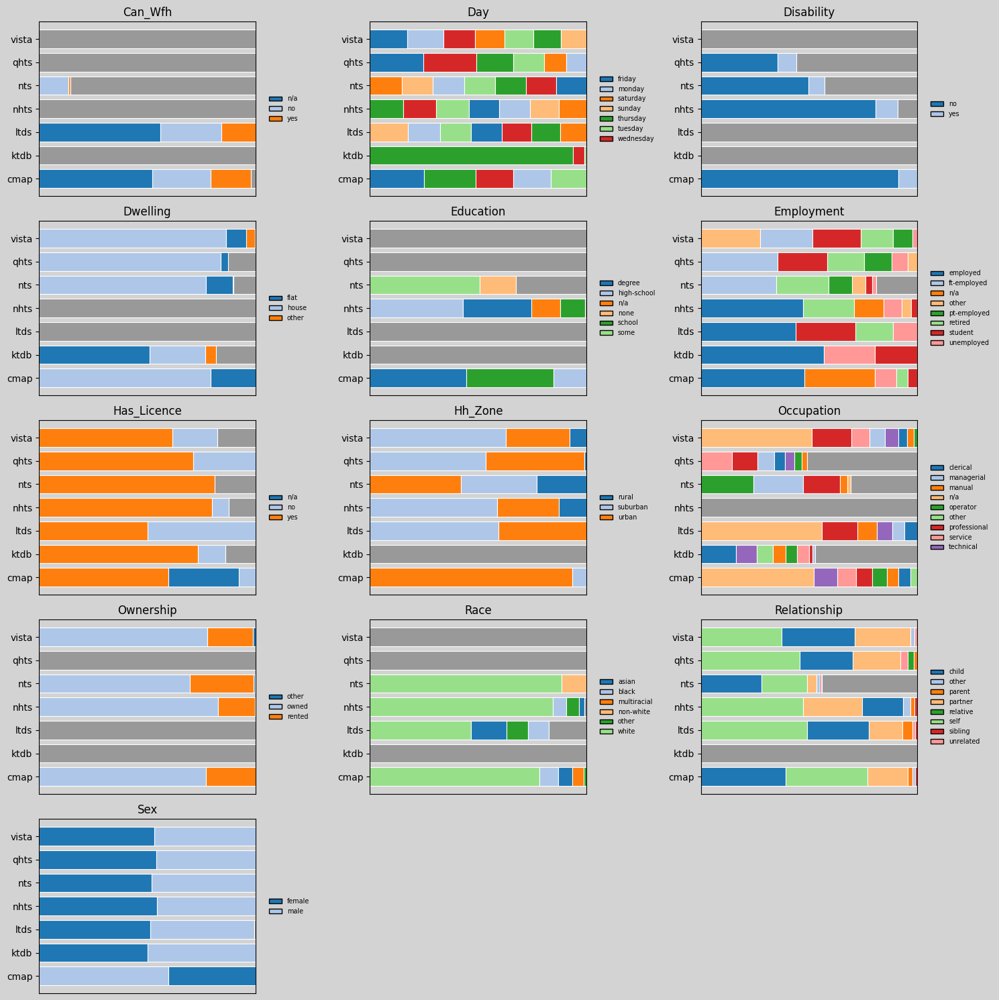
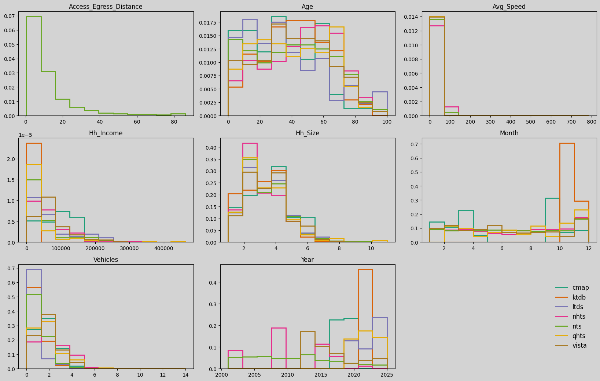

Foundata is a pipeline for creating reconciled household travel surveys.

Foundata is an effort towards building a dataset for enabling *foundational* or *world* models of human behaviour. But it is also a useful source of code for those wishing to work with available datasets. We also have a pre-processed dataset of one-million openly available persons and their plans [here](https://github.com/fredshone/foundata/tree/main/data/).

### Progress

| source | persons | missing data     | trips   | kms (millions) |
|--------|---------|-----------|---------|-----------------|
| London UK (LTDS)   | 71,734  | 27%      | 137,900 | 1.4        |
| UK (NTS)    | 2,560,548 | 15%    | 5,106,905 | 65.2   |
| US (NHTS)   | 716,376 | 16%      | 2,604,832 | 42.1     |
| Chicago US (CMAP)   | 31,540  | ~0%       | 101,965 | 0.8        |
| Victoria AUS (VISTA)  | 94,821  | 20%      | 257,557 | 2.5        |
| Queensland AUS (QHTS)   | 51,481  | 25%      | 126,485 | 1.4        |
| South Korea (KTDB)      | 133,326     | 42%      | 334,049 | 1.6        |
| **total** | **3,659,826** | **17%** | **8,666,499** | **114.9** |


### Person Attributes Status

Categorical person attributes, **Blank** signifies missing or "unknown" data:



Numeric person attributes:



### Trips (As 24hr Plans) Status

We encode human activity plans as sequences of trips, joinable by a unique person id (pid) to each other and their attributes. Temporal and spatial consistency is enforced, so that activity sequences should be physically plausible.

We currently map all activities to the following types: {home, work, education, visit, medical, leisure, shop, escort, other}.

We currently map all transport models to the following types: {car, walk, bike, bus, rail, other}.


### ToDo

- Collect additional features, such as weather conditions and accessibility.
- We currently combine all plan attributes as *person* attributes, but infact we use *household*, *person*, *day*, and *plan* attributes. We could distinguish these better.
- More data, see below: 


|  source           |     | persons  | years     | label availability | source  |
| ----------------- |---- | -------- |-----------|---------------|--------------------|
| KTDB              | S.Korea | 100k | 21        | C             | [request](https://www.ktdb.go.kr/www/index.do) (stay on korean language site)     |
| NTS               | UK  | 1.7m     | 02-23     | A             | [request](https://ukdataservice.ac.uk/) (not open)            |
| CMAP              | US  | 30k      | 17-19     | A-            | [data](https://github.com/CMAP-REPOS/mydailytravel) (open) |
| NHTS              | US  | 700k       | 01,09,17,22 | A           | [data](https://nhts.ornl.gov/downloads) & [docs](https://nhts.ornl.gov/documentation) (open) |
| QHTS        | AUS | 50k     | 12-24     | A-            | [data](https://www.data.qld.gov.au/dataset/queensland-household-travel-survey-series) (open) |
| VISTA         | AUS | 100k     | 12 -> 25  | B+            | [here](https://opendata.transport.vic.gov.au/dataset/victorian-integrated-survey-of-travel-and-activity-vista) (open) |
| LTDS              | UK  | 70k     | 19 -> 24  | B+            | request from TfL (open) |
| **Metropolitan (US datasets)** :   ||||                        | [data](https://www.nrel.gov/transportation/secure-transportation-data/tsdc-metropolitan-travel-survey-archive) (open) |
| California        | US  | 40k      | 01        | OK?           |
| LA                | US  | ?        | 01        | BAD?          |
| Seattle           | US  | 37k      | 00/02     | OK?           |
| SanFran           | US  | 35k      | 00        | OK?           |
| NY                | US  | 27k      | 98        | OK?           |
| Philly            | US  | 10k      | 00        | OK?           |
| Pheonix           | US  | 10k      | 02        | OK?           |
| Baltimore         | US  | 8k       | 01        | OK?           |
| Indiana           | US  | 8k       | 07/08     | OK?           |
| Spokane           | US  | 7k       | 05        | BAD?          |
| Idaho             | US  | 6k       | 02        | OK?           |
| Columbia          | US  | ~3k      | 07        | OK?           |
| Anchorage         | US  | 3k       | 01        | OK?           |


## Usage

### Setup

```bash
uv sync          # install dependencies and register the CLI entry point
foundata --help  # confirm two commands are available
```

### Adding a new source

1. **Scaffold boilerplate** — generates empty YAML configs and a stub loader:
   ```bash
   python scripts/scaffold_source.py <source>
   ```

2. **Populate YAML configs** in `configs/<source>/`:
   - `hh_dictionary.yaml` — household column mappings and value remappings
   - `person_dictionary.yaml` — person column mappings and value remappings
   - `trip_dictionary.yaml` — trip column mappings and value remappings

3. **Validate YAML configs** against the template schema:
   ```bash
   foundata validate-config <source>
   ```
   Fix any reported ERRORs (value labels not in the template set). WARNs for
   intermediate fields are expected and can be ignored.

4. **Implement `load()`** in `foundata/<source>.py` following the pattern of
   existing loaders (e.g. `nhts.py`). The function should return
   `(attributes_df, trips_df)` normalised to the template schema.

5. **Run the loader, write CSVs, then validate output**:
   ```bash
   foundata validate-table attributes.csv trips.csv
   ```

6. **Add the source to `run.ipynb`** so it is included in the full pipeline run.

### Running specific sources

Use `--source` / `-s` to run only a subset of sources (can be repeated):

```bash
# Run KTDB only
uv run python scripts/run.py --data-root ~/Data/foundata --source ktdb --output /tmp/out

# Run KTDB and NTS
uv run python scripts/run.py --data-root ~/Data/foundata -s ktdb -s nts --output /tmp/out
```

Available sources: `ltds`, `vista`, `qhts`, `cmap`, `nhts`, `nts`, `ktdb`.
