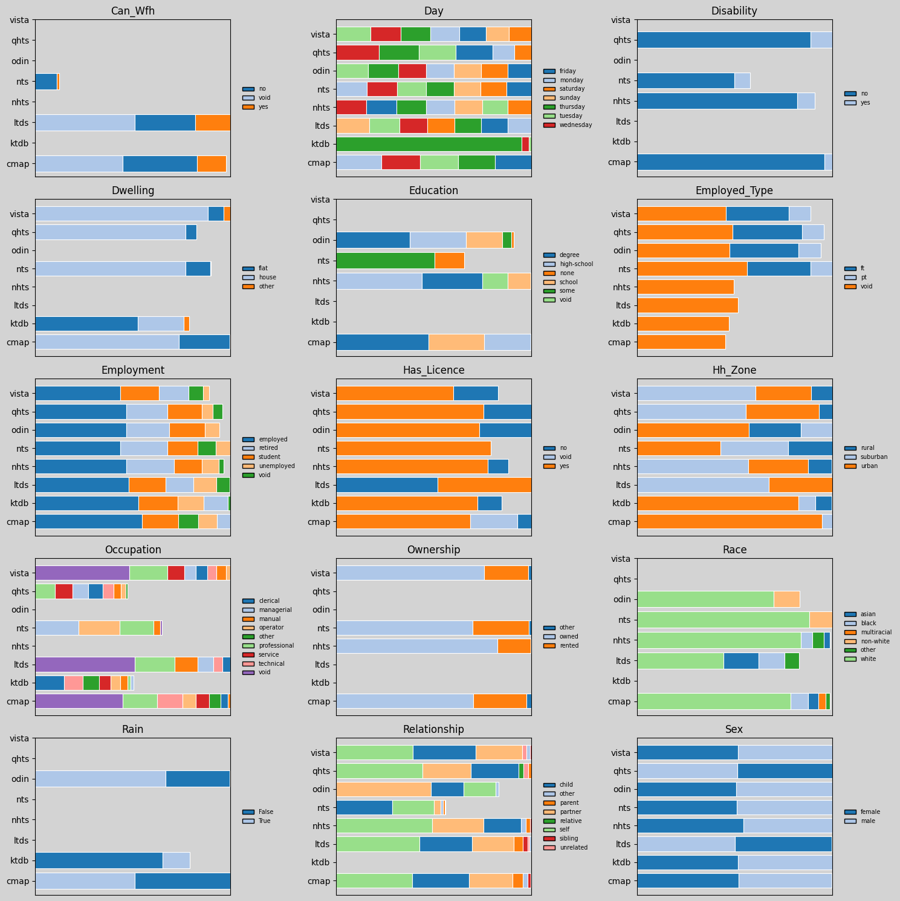
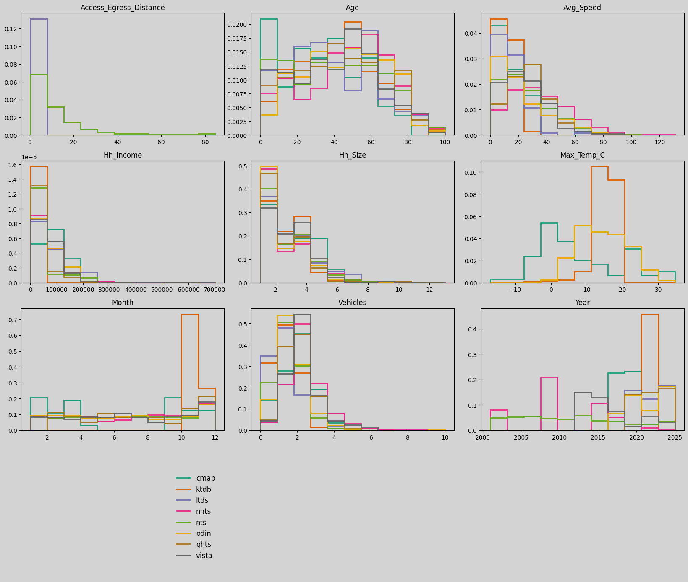
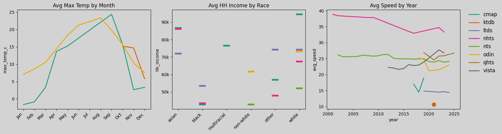
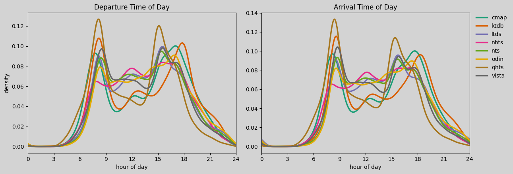
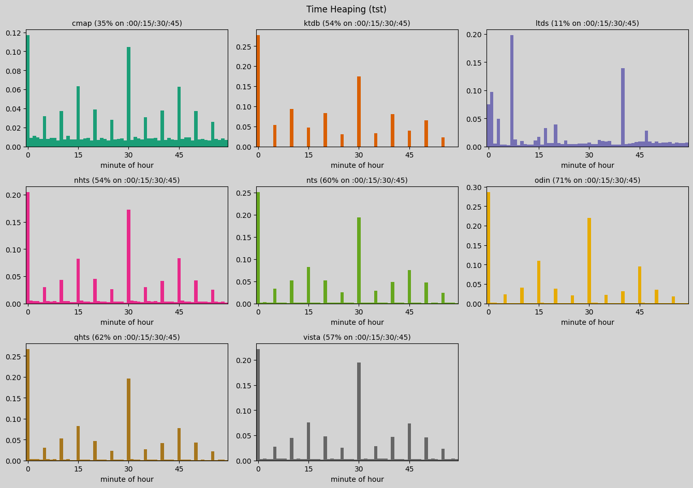
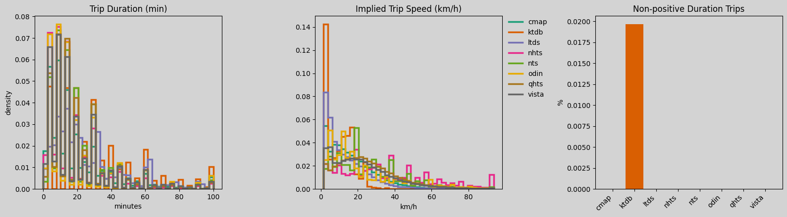
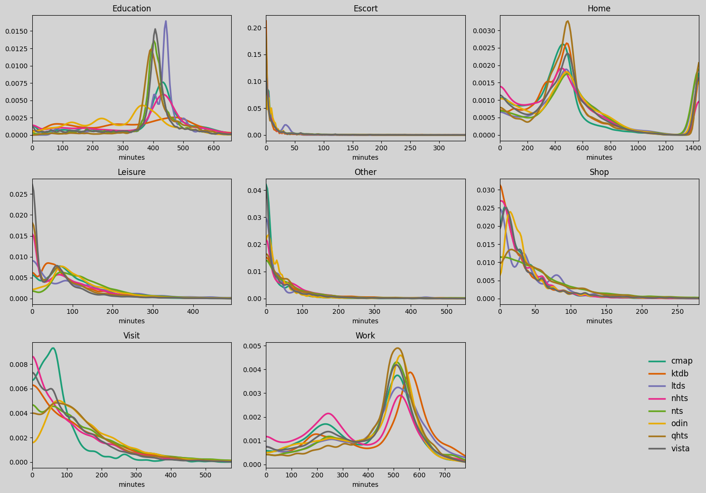
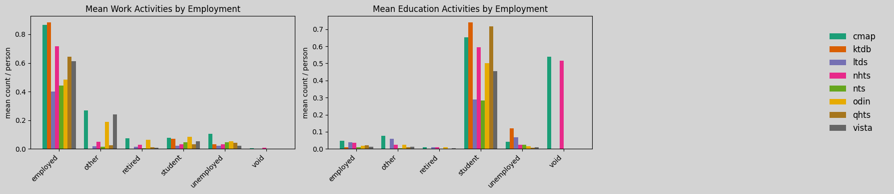
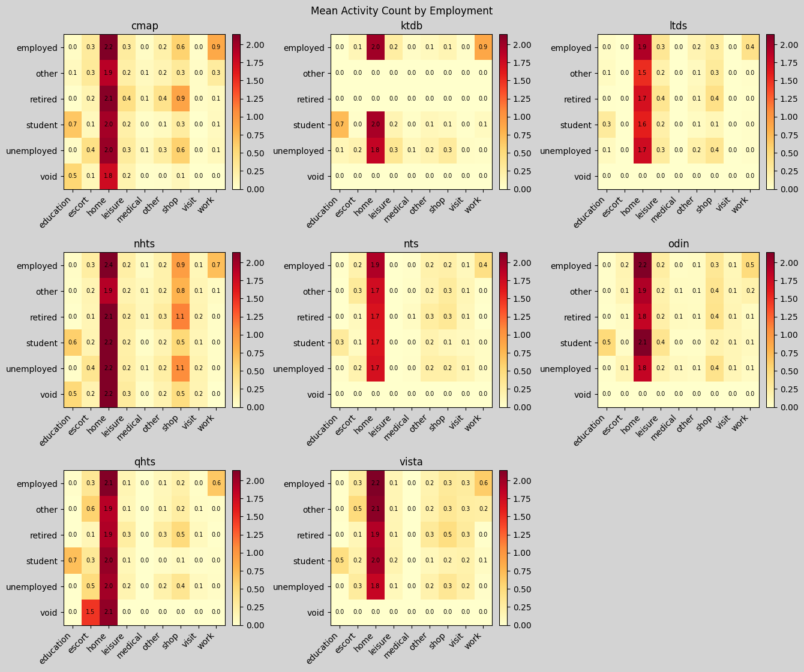

[](https://github.com/fredshone/foundata/actions/workflows/weekly.yml)

Foundata is a pipeline for creating reconciled household travel surveys, aimed at enabling *foundational* models of human behaviour — but also a useful source of code for those wishing to work with openly available datasets.

We also have a pre-processed dataset of one-million openly available persons and their plans [here](https://github.com/fredshone/foundata/tree/main/data/).

The project is intended to be uses as a discoverable cli via `uv run foundata --help`.

For example, `uv run foundata run --help`:
```
Usage: foundata run [OPTIONS]

  Run the data processing pipeline end-to-end.

Options:
  -d, --data-root PATH                                Base data directory, e.g. ~/Data/foundata [required]
  -o, --output PATH                                   Directory where CSVs and PNGs are written, defaults to ./output  [default: output]
  -s, --select TEXT                                   Comma-separated list of sources to process (e.g. --select nhts --select ktdb).
  -x, --omit TEXT                                     Comma-separated list of sources to omit (e.g. --omit nhts --omit ktdb).
  -hb, --home-based / -ab, --any-based                Whether to only include home-based trips (i.e. those with 'home' as the origin or destination activity).  [default: home-based]
  -fc, --filter-consecutive / -ac, --any-consecutive  Whether to filter out consecutive home, work and education activities. [default: filter-consecutive]
  --help                                              Show this message and exit.
```

The base data directory needs to hold raw data downloaded from the various sources by the user. The template directory `data_dir_template`, shows the expected folder and files structure.

### Data Summary

The latest output using `uv run foundata run` is as follows:


| Source | Plans* | Missing attributes** | Trips | Trip kms (millions) |
|------|-----|------------|-----|--------------|
| odin | 324,609 | 25% | 764,037 | 8.4 |
| ltds | 60,526 | 36% | 108,367 | 0.9 |
| vista | 89,465 | 29% | 235,847 | 2.0 |
| cmap | 25,716 | 7% | 76,658 | 0.5 |
| qhts | 48,718 | 33% | 117,885 | 1.2 |
| ktdb | 120,100 | 39% | 285,011 | 0.8 |
| nhts | 630,925 | 27% | 2,201,088 | 24.9 |
| nts | 2,483,044 | 22% | 4,420,967 | 45.4 |
| **total** | **3,783,103** | **24%** | **8,209,860** | **84.1** |

\* a plan is a sequence of activities and associated trips within a 24hr period starting at midnight.

\*\* missing plan attribute data (ie unknown values)

### Data Sources

Foundata makes use of open (safely available, either immediately, or available via simple request) datasources as follows


|  Name             | Location  | ~Years    | Note              | Source             |
| ----------------- |---------- |-----------|-------------------|--------------------|
| ODIN        | Netherlands | 2018-24 | Currently missing 2021 | [request](https://ssh.datastations.nl/dataset.xhtml?persistentId=doi:10.17026/SS/TR1TUW)     |
| KTDB        | S.Korea |  2021        |  | [request](https://www.ktdb.go.kr/www/index.do) (stay on korean language site)     |
| NTS         | UK      | 2002-24     |                   | [request](https://ukdataservice.ac.uk/)            |
| CMAP        | US      | 17-19     |                   | [data](https://github.com/CMAP-REPOS/mydailytravel) |
| NHTS        | US      | 2001,09,17,22 |               | [data](https://nhts.ornl.gov/downloads) & [docs](https://nhts.ornl.gov/documentation) |
| QHTS        | AUS | 2012-24     |          | [data](https://www.data.qld.gov.au/dataset/queensland-household-travel-survey-series) |
| VISTA       | AUS | 2012-25  |             | [data](https://opendata.transport.vic.gov.au/dataset/victorian-integrated-survey-of-travel-and-activity-vista) |
| LTDS        | UK  | 2019-24  | Exact trip times and durations are sampled | request from TfL |

### Trips/Plans

We encode human activity plans as sequences of activities and associated trips. We output both activity-based and trips-based representations of plans. Temporal and spatial consistency is enforced, so that activity sequences should be physically plausible.

We currently map all activities to the following types: {home, work, education, visit, medical, leisure, shop, escort, other}. Note that not all sources use all of these types. Medical, for example, is not included in many datasets.

We currently map all transport modes to the following types: {car, walk, bike, bus, rail, other}.

### Person Attributes

Plans are joinable by a unique person id (pid) to attributes. Attributes include household, individual, day and plan information.

Categorical person attributes, **Blank** signifies missing or "unknown" data:



There has been a lot of effort to consolidate categories across the different data sources. You can see the mappings used in `/configs`. Note that (i) we allow unknown categories (null or unknown), and (ii) in some cases we allow "overlapping" categories.

Numeric person attributes:



A sample of some trends:




## Usage

### Setup

```bash
uv sync          # install dependencies and register the CLI entry point
foundata --help
```

### Trying it out with example data

`data_dir_template/` is a small, runnable stand-in for a real `~/Data/foundata/`
tree — same folder/file layout, just a handful of rows per source — so you can
try the pipeline without access to any of the real (often restricted) survey
extracts:

```bash
foundata run --data-root data_dir_template --output /tmp/out
```

CMAP, NHTS, QHTS and VISTA are public/open datasets, sampled directly with
real values. ODiN, KTDB, NTS and LTDS are restricted-access research datasets:
their rows use fresh synthetic ids and have their demographic/attribute
columns independently shuffled across the sampled group, so no real
respondent's full attribute combination appears, while trip/stage rows are
left internally intact so trip logic (sequencing, times, zones) stays
coherent. See `scripts/build_data_dir_template.py` for how it's built (it
regenerates `data_dir_template/` from a real `~/Data/foundata/` tree — sibling
to `scripts/generate_fixtures.py`, which builds the smaller `tests/fixtures/`
used by the unit tests).

### Adding a new source

1. **Scaffold boilerplate** — generates empty YAML configs and a stub loader:
   ```bash
   python scripts/scaffold_source.py <source>
   ```

2. **Populate YAML configs** in `configs/<source>/`:
   - `hh_dictionary.yaml` — household column mappings and value remappings
   - `person_dictionary.yaml` — person column mappings and value remappings
   - `trip_dictionary.yaml` — trip column mappings and value remappings

3. **Validate YAML configs** against the template schema:
   ```bash
   foundata validate-config <source>
   ```
   Fix any reported ERRORs (value labels not in the template set). WARNs for
   intermediate fields are expected and can be ignored.

4. **Implement `load()`** in `foundata/<source>.py` following the pattern of
   existing loaders (e.g. `nhts.py`). The function should return
   `(attributes_df, trips_df)` normalised to the template schema.

5. **Run the loader, write CSVs, then validate output**:
   ```bash
   foundata validate-table attributes.csv trips.csv
   ```

6. **Add the source to `foundata/run.py`** so it is included in the full pipeline run (follow the existing `if "source" in sources:` pattern).

### Running specific sources

Use `--select` / `-s` to run only a subset of sources, or `--omit` / `-x` to exclude sources:

```bash
# Run KTDB only
foundata run --data-root ~/Data/foundata --select ktdb --output /tmp/out

# Run KTDB and NTS
foundata run --data-root ~/Data/foundata -s ktdb -s nts --output /tmp/out

# Run everything except NTS
foundata run --data-root ~/Data/foundata --omit nts --output /tmp/out
```

Available sources: `ltds`, `vista`, `qhts`, `cmap`, `nhts`, `nts`, `ktdb`.

### Binning numeric attributes

The `bin` command discretises numeric columns in an attributes CSV into labelled string bins, using the same quantile/uniform logic as the pipeline's `binned_attributes.csv` output — but runnable on any attributes file with full control over bin counts.

```bash
# All numeric columns binned into 5 quantile bins (default)
foundata bin attributes.csv

# Override the default bin count
foundata bin attributes.csv --default 8

# Per-column overrides: --COLUMN N takes precedence over --default
foundata bin attributes.csv --default 5 --age 10 --hh_income 3

# Uniform (equal-width) bins, explicit output path
foundata bin attributes.csv --default 5 --method uniform --output binned.csv
```

Options:

| Option | Short | Default | Description |
|--------|-------|---------|-------------|
| `--default N` | `-n` | `5` | Default number of bins for all numeric columns. |
| `--method` | `-m` | `quantile` | `quantile` (equal-frequency) or `uniform` (equal-width). |
| `--output PATH` | `-o` | `<input>_binned.csv` | Output CSV path. |
| `--COLUMN N` | | | Per-column bin count override (e.g. `--age 10`). |

### Filtering output CSVs

The `filter` command group applies post-processing filters to `attributes.csv` / `trips.csv` outputs.
All filter commands accept `-a`/`--attributes` (optional), `-t`/`--trips` (required), and output options `-o` (directory), `-oa` (explicit attributes path), `-ot` (explicit trips path).

```bash
foundata filter --help
```

| Command | Description |
|---------|-------------|
| `homebased` | Keep only plans whose first and last activity is home. |
| `missing-acts-or-modes` | Remove plans with null or `unknown` activities or modes. |
| `consecutive-activities` | Remove plans with consecutive same-type activities (e.g. work→work). Configurable via `-n`/`--non-consecutive-types` (default: `home`, `work`, `education`). |
| `negative-trips` | Remove plans containing trips where `tst > tet`. |
| `negative-activities` | Remove plans with overlapping trip times (negative activity durations). |
| `null-times` | Remove plans with null trip start or end times. |
| `time-consistent` | Apply all time-consistency filters in one step. |
| `attributes` | Filter persons on a column value and restrict trips to survivors. |

Example:

```bash
foundata filter consecutive-activities -t trips.csv -a attributes.csv -n work -n education -o output/
```

### Splitting into train/test sets

The `split` command creates train/test splits of one or more CSVs, keeping all records for each person entirely in one set (never split across both). Pass any number of CSV files — they must all share the same set of group IDs.

```bash
foundata split attributes.csv trips.csv activities.csv --split 20 --output /tmp/split/
```

Output:

```
Split on 'pid': 800 train / 200 test (20%)
  attributes.csv                 →     800 train /     200 test rows
  trips.csv                      →    6431 train /    1612 test rows
  activities.csv                 →    9204 train /    2301 test rows
Wrote outputs to /tmp/split/
```

Each input file produces `<stem>_train.csv` and `<stem>_test.csv` in the output directory.

Options:

| Option | Short | Default | Description |
|--------|-------|---------|-------------|
| `--group COL` | `-g` | `pid` | Column to group by. |
| `--split PCT` | `-s` | `20` | Test set size as a percentage. |
| `--output DIR` | `-o` | parent of first input | Output directory. |
| `--seed N` | | `42` | Random seed for reproducibility. |


### Diagnostics

Departure/arrival time-of-day density, wrapped onto a 0-24h axis. The legend shows each source's share of trips with a raw start/end time greater than 1440 minutes (an uncorrected day-wrap is a common symptom of a source-specific time bug):



Minute-within-hour "heaping" per source — self-reported times tend to round to :00/:15/:30/:45, and a source heaping much more than the others usually means less precise raw timestamps:



Trip duration, implied speed (`distance / duration`), and the share of trips with non-positive duration, per source:



Activity duration distributions, faceted by activity type:



Mean per-person activity count (work, education) by employment category:



The same comparison as a heatmap (employment category x activity type, shared colour scale per source):


